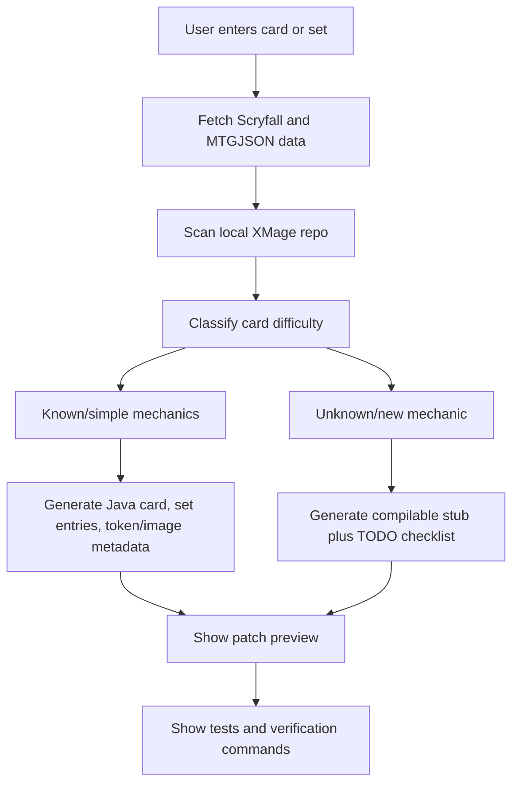

# XMage Card Importer Workbench

## Goal
Create a desktop-capable UI tool that automates the repeatable parts of importing cards into XMage while keeping human review for actual rules behavior. The tool should turn “add this card/set” into a guided workflow: fetch data, detect what exists, generate stubs or reuse existing implementations, update set metadata, produce tests/check commands, and show what still needs a developer.

## Product Shape
- Build under our owned surface, preferably `webclient/tools/card-importer/`, using React + TypeScript so it matches the existing frontend stack.
- Package as a Tauri executable after the MVP works as a local dev app. Tauri is already part of the project’s intended stack, and avoids adding a heavy Electron runtime.
- Default behavior should be “dry-run patch generation”: write proposed outputs to a staging folder or patch file first, then let the user apply/review them. Direct writes into `Mage.Sets/`, `Mage/`, or `Mage.Client/` should be an explicit advanced action because those are upstream-owned areas in this fork.

## Workflow

## Core Capabilities
- Data import: fetch card and set metadata from Scryfall and/or MTGJSON, including name, oracle text, layout, mana cost, type line, rarity, collector number, faces, tokens, and release data.
- Repo scanner: inspect `Mage.Sets/src/mage/cards/`, `Mage.Sets/src/mage/sets/`, `Mage/src/main/resources/tokens-database.txt`, and image-support files to detect existing implementations and missing entries.
- Difficulty classifier: label each card as `reprint`, `simple stub`, `known mechanic`, or `needs engine work` based on whether the class exists and whether oracle keywords map to known XMage ability classes.
- Generator: create Java card classes using XMage patterns, generate `SetCardInfo` lines, generate token database entries, and propose Scryfall image support entries where needed.
- Review UI: show source data, generated Java, set-file insertion point, confidence level, TODOs, and exact verification commands before anything is applied.
- Validation runner: surface commands like `VerifyCardDataTest#test_showCardInfo`, missing-token checks, and full Maven verify steps, with copy/run buttons in later versions.

## Implementation Phases
1. Recon and data model
   - Define internal TypeScript models for `ImportedCard`, `ImportedSet`, `GeneratedChange`, and `ImportIssue`.
   - Map Scryfall/MTGJSON fields to XMage concepts: class name, package letter, mana cost, card types, supertypes, subtypes, rarity, collector number, layout, power/toughness, loyalty, defense.
   - Use existing local examples from `Mage.Sets/src/mage/cards/` and set registry patterns in `Mage.Sets/src/mage/sets/` as templates.

2. Read-only repo scanner
   - Build scanners for existing card class files, set files, token database entries, and image support entries.
   - Detect duplicate card names, multi-printing variants, split/double-faced layouts, and whether a card is already implemented but missing from a set.
   - Keep this phase read-only and testable with snapshots.

3. Single-card MVP
   - UI accepts one card name plus target set code.
   - Fetches official data.
   - Generates a Java card file preview and a `SetCardInfo` preview.
   - For simple cards, map card facts into Java syntax.
   - For rules text, generate only what is safe: evergreen/simple keyword abilities when known, plus TODO comments for unmatched rules text.

4. Patch generation
   - Produce a unified diff or staged output folder rather than direct edits.
   - Include generated files, set-file insertion changes, and a generated checklist.
   - Add a confidence summary: “ready to compile,” “requires rules implementation,” “requires token work,” or “requires image metadata.”

5. Reprints and set import
   - Add batch mode for a whole set.
   - Automatically add reprints where the class already exists.
   - Generate issue/checklist views for unimplemented cards.
   - Group cards by difficulty so a maintainer can knock out easy cards first.

6. Token and image support
   - Parse Scryfall token data for the set.
   - Propose `tokens-database.txt` entries.
   - Propose Scryfall token image entries.
   - Detect token classes that already exist versus token classes that need new Java work.

7. Verification integration
   - Add UI actions that explain and optionally run the relevant Maven tests.
   - Start with command display, then add safe command execution once the tool is trusted.
   - Store result logs in the tool UI so users can iterate.

8. Desktop packaging
   - Wrap the app with Tauri.
   - Add file-picker support for choosing the XMage repo path.
   - Add settings for Scryfall/MTGJSON cache location, dry-run output folder, and preferred author name.

## Automation Boundaries
- Fully automatable: fetching official data, class-name generation, file path selection, simple Java skeletons, basic card facts, `SetCardInfo` lines, reprint detection, missing-card reports, patch previews, and verification command generation.
- Partly automatable: evergreen keywords and common ability patterns, using a library of known mappings.
- Human-required: genuinely new mechanics, weird replacement effects, timing/rules edge cases, multiplayer interactions, copied spells, zone-change memory, and anything that needs new engine behavior.

## Safety Rules
- The tool must never silently modify upstream-owned code. It should preview patches first.
- Every generated file should be deterministic so repeated runs produce stable diffs.
- Generated card classes should compile or clearly mark themselves as TODO-only drafts.
- The UI should distinguish “metadata complete” from “rules implementation complete.”
- No schemaVersion impact for our WebApi unless this tool later exposes a server API.

## Test Plan
- Unit tests for name-to-class conversion, mana/type parsing, rarity mapping, collector-number handling, and set-entry generation.
- Snapshot tests for generated Java card files and set-file patches.
- Fixture tests using known simple cards, known reprints, split cards, double-faced cards, and token-producing cards.
- Integration tests against a small copied fixture of `Mage.Sets` files before touching the real repo.
- Manual validation by generating one simple card patch and running XMage verification commands.