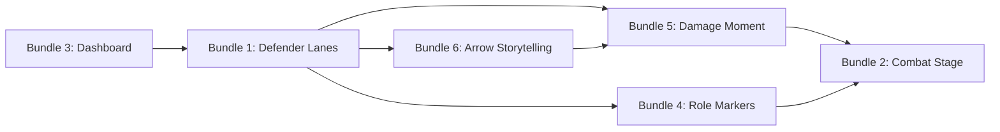

# Combat Phase Brainstorm — Six Idea Bundles

> **Source:** Original brainstorm authored 2026-05 from three parallel design passes (interaction, visual, motion design) merged into six idea bundles. Originally lived as a Cursor plan file at `~/.cursor/plans/combat_phase_brainstorm_clusters_5c8a1050.plan.md`; copied into the repo here on 2026-05-09 so future agents have a stable in-repo reference.
>
> **Status snapshot (2026-05-10):**
> - **Bundle 3 — Combat Dashboard:** SHIPPED on `feat/combat-bundle-3-dashboard` (merged into `main`). Per-bundle scope brief: [`docs/design/combat-bundle-3-dashboard.md`](combat-bundle-3-dashboard.md). Critic-pass post-mortem: [`docs/decisions/0014-self-authored-spec-failure-modes.md`](../decisions/0014-self-authored-spec-failure-modes.md).
> - **Bundle 1 — Defender Lanes:** SHIPPED on `feat/combat-bundle-1-defender-lanes` (merged into `main` 2026-05-09 as `2d6b6e40`). Per-bundle scope brief: [`docs/design/combat-bundle-1-defender-lanes.md`](combat-bundle-1-defender-lanes.md). Critic-pass log rows: 1-A through 1-X.3 + live-test tunings burst in [`docs/decisions/critic-pass-log.md`](../decisions/critic-pass-log.md).
> - **Bundle 4 — Combat Role Markers:** SHIPPED on `feat/combat-bundle-4-role-markers` (merged into `main` 2026-05-10 as `30d89e6698`). Per-bundle scope brief: [`docs/design/combat-bundle-4-role-markers.md`](combat-bundle-4-role-markers.md). Critic-pass log rows: 4-A through 4-X.1 (including bundle-level 4-specialist critic pass at 4-X.0) in [`docs/decisions/critic-pass-log.md`](../decisions/critic-pass-log.md).
> - **Foundation: central-area mutex resolution** — scope brief landed 2026-05-10; user-decision pending. [`docs/design/foundation-central-area-mutex.md`](foundation-central-area-mutex.md). Recommendation: Option C (shrink the stack) — unblocks Bundles 5 + 6 + benefits Bundle 2.
> - **Bundles 2, 5, 6:** still in brainstorm state; no per-bundle scope brief written yet. Bundles 5 + 6 are gated on the foundation-mutex decision above. Bundle 2 (Combat Stage) is independent but lower-leverage than Bundle 5.
>
> **Open questions still to be answered (originally listed at the bottom of this brainstorm):**
> - Which bundles to pursue and in what order beyond Bundles 3 / 1 / 4. (Recommended next: foundation-mutex → Bundle 5 → Bundle 6 → Bundle 2.)
> - ~~How to handle the "central area can only show one thing at a time" snag — live with it, move arrows elsewhere, or shrink the stack during combat.~~ Resolved at scope-brief stage; user-decision pending in [`docs/design/foundation-central-area-mutex.md`](foundation-central-area-mutex.md).
> - Whether the server already exposes per-opponent commander damage on the wire (needed for Bundle 5's lethal-21 moment). If not, that sub-feature can't ship without server-side work first.

---

This is a digest of three brainstorms (interaction design, visual design, motion design) merged into six big idea bundles. Each bundle is a coherent feature — not a single tweak, but a small set of changes that work together. Pick the ones that excite you and we'll go deeper on each.

## What we already have

Some of these primitives are load-bearing for everything below, so it helps to know they exist:

- **Combat arrows** that draw from each attacker to whoever they're attacking (a player or a blocker), with smart features: when many attackers point at the same target, the arrowheads fan out instead of stacking on one pixel; when you hover an attacker, blocker, or player portrait, unrelated arrows dim to 25% so you can trace one matchup at a time.
- **A combat banner** at the bottom of the screen during "declare attackers" and "declare blockers" that tells you what to do and gives you a Done button. You actually pick attackers/blockers by clicking the creatures on the board, not by clicking the banner.
- **A priority system** that auto-pauses the game at every combat sub-step (begin combat, declare attackers, declare blockers, first-strike damage, regular damage, end of combat) so you can react.
- **Player portraits** that already glow with each player's commander colors, and have a rotating "lane spotlight" highlight when it's their turn.
- **A central focal area** in the middle of the table that switches between showing the stack (pending spells) and showing combat arrows.

---

## Important snag to decide on first

**The central area can only show one thing at a time.** Today, if a stack appears (someone casts an instant during combat, or a triggered ability fires), the combat arrows vanish. This matters because several bundles below assume the arrows stay on screen while damage is resolving. Three ways to handle it:

1. **Live with it.** When the stack is busy, the cinematic damage moments degrade to portrait-only feedback (life flashes, glow envelopes). Simple, but the headline moments lose some of their punch.
2. **Move the arrows somewhere else** when the stack is busy — maybe a faint, viewport-wide overlay drawn behind the cards. Always visible, but more visual noise.
3. **Shrink the stack** during combat so it tucks into one corner of the focal area, leaving room for the arrows to coexist. Most ambitious; needs the central area architecture to change.

This isn't urgent for every bundle, but it gates Bundles 5 and 6.

---

## Bundle 1 — Defender Lanes

**What it solves:** "Wait, who's actually being attacked? Are there 4 attackers on me and 2 on Lyrra, or the other way around?"

**What it does for you:**

- **Arrows take on each opponent's colors.** Right now every combat arrow is the same neutral color. Instead, the arrow's color matches the *defending player's commander* — so a swing into your green/white opponent draws in green/white tones, while a swing into your blue opponent draws in blue. Multicolor opponents get a gradient stroke. You can read "where is this attack going?" without following the arrow's whole path.
- **Soft colored beams from the center toward each player being attacked.** Imagine a low-opacity wash of color radiating out from the middle of the table, pointing toward whichever opponents are taking damage. Idle pods stay neutral. At a glance you see the *distribution* of pressure across the table.
- **Small "incoming" tags on each opponent's portrait.** A little count appears next to each player being attacked: "incoming 3 — 2 unblocked." Click it and the arrows for that player highlight, dimming everyone else.
- **Arrows reveal one wave at a time.** When attackers are declared, instead of all arrows popping in at once, they fade in *defender by defender* — first the arrows pointing at one opponent, then 90ms later the next opponent's, and so on around the table. Your eye does one calm sweep instead of trying to parse a chaotic instant.

**Effort:** Medium-sized — touches the arrow renderer, the player portraits, and adds a couple new overlays.

**Risk:** Color alone isn't enough for accessibility, so we'd pair color with shape/dash differences. Need to make sure the "incoming" tag doesn't crowd the existing portrait glow.

---

## Bundle 2 — Combat Stage

**What it solves:** "Combat just kind of... happens. There's no sense of *occasion* when it starts and ends."

**What it does for you:**

- **The board dims slightly around the edges.** When combat begins, a soft vignette darkens the outer tabletop. Pods feel like audience seating; the central focal area feels like a lit stage.
- **The central area gets a frame.** Not heavy — a subtle inner shadow and a thin gold edge, just enough to signal "the action is here now."
- **A gentle scene-change between combat sub-steps.** When the game moves from "declare attackers" to "declare blockers" to "damage," the central area cross-fades — a quick 0.15-second softening of the previous mode, then a 0.25-second ease into the next. At the very start of combat (and the very end) the central frame does one slow pulse, like a director clapping the slate.

**Effort:** Big — needs a new "combat mode coordinator" so this doesn't fight the existing animations.

**Risk:** It can become a second modal layer over the board if we push the dimming too hard. Strict opacity caps so it reads as atmosphere.

---

## Bundle 3 — Combat Dashboard

> **Status:** SHIPPED on `feat/combat-bundle-3-dashboard` (2026-05-09). See [`docs/design/combat-bundle-3-dashboard.md`](combat-bundle-3-dashboard.md) for the full per-bundle scope brief, and the seven Bundle-3 rows in [`docs/decisions/critic-pass-log.md`](../decisions/critic-pass-log.md) for what shipped vs. what was caught at critic-pass time.

**What it solves:** "Which combat sub-step are we even on? Why can't I press Done? Did I just miss my window?"

**What it does for you:**

- **The phase strip at the top expands to show the five combat sub-steps as a runway.** Begin Combat → Declare Attackers → Declare Blockers → First-Strike Damage → Combat Damage → End of Combat. Past steps look muted with a check mark; the active step pulses; future steps are ghosted. When it's not your priority, the strip shows "waiting on Lyrra" so you don't sit confused.
- **A clearer label for what's happening.** A slim ribbon next to the phase strip shows the rules-step name plus operational state in small caps: "ACTIVE / PRIORITY" when it's yours, "PASSING" when it's not. One accent color reserved for "this is on you" so you don't mistake whose move it is.
- **The combat banner gets organized.** Today the banner is one line of amber text plus a Done button. We restructure it: a clean "Combat" headline, a subtitle that says exactly which sub-step you're in, and an outlined Done pill that visually pops when it's the next move and goes quiet when it isn't.
- **Five small ticks under the banner that move with you.** A miniature five-dot meter mirrors the runway above, so the bottom-of-screen banner and the top-of-screen phase strip feel synchronized. A little colored dot travels the meter on the steps where the system is going to stop and give you priority.
- **A "what you've staged" recap.** Beneath the banner prompt, two lines auto-populate from your in-progress choices: "Chosen attackers: Goblin, Hydra, Spirit Token" / "Staged blockers: Wall on Hydra." So when you wonder why you can't Done, the answer is right there. (Crucially, no damage math previews — that's out of scope per your direction.)

**Effort:** Small to medium. **The cheapest bundle and probably the fastest "this feels noticeably better" win.**

**Risk:** A couple of the sub-steps may briefly look "stuck" if the server hasn't sent the next frame yet. Needs careful state-mapping.

---

## Bundle 4 — Combat Role Markers

**What it solves:** "Even with the arrows visible, when there are 8 creatures on the field I lose track of which ones are participating in combat at all."

**What it does for you:**

- **Warm corner brackets on attackers, cool corner brackets on blockers.** Tiny L-shaped brackets pinned to the corners of each creature's tile. Attackers get an orange/warm pair; blockers get a blue/cool pair; everyone else is unmarked. You can scan the entire battlefield in one pass and see who's in combat.
- **Two rings around participating creatures, not one.** The inner ring shows the combat role (attacker / blocker / unmarked); the outer ring is the existing commander-color halo that already exists. So a green/white attacker shows a warm-orange inner ring with a green/white outer ring — pod ownership and combat role never compete for the same pixel.
- **During declare attackers/blockers, eligible creatures gently glow.** When the game is asking you to pick attackers, the creatures you *can* attack with shimmer faintly with a focus ring. Same when you're picking blockers. Pure wayfinding — "these are the things you can click right now" — not damage math.
- **Tapped (sideways) creatures keep their brackets oriented sensibly.** If turning the brackets 90° with the card hurts readability, we fall back to a small upright "A" or "B" sigil so the role is still legible at a glance.

**Effort:** Medium. Touches every creature card on the battlefield.

**Risk:** When the board is very crowded, 6+ overlapping glows can become noisy. We'd add a "level of detail" rule — if cards are below a certain size, switch to icons-only.

---

## Bundle 5 — Damage Moment

**What it solves:** "Damage just... happens. The life total ticks down and I missed why. Did my creature die? Was that lethal? Was that commander damage?"

This is the cinematic-payoff bundle. It's the one most likely to make combat *feel* exciting.

**What it does for you:**

- **Glowing pulses fly along the arrows when damage actually lands.** When a player loses life from combat, a small bright "parcel" travels from the attacker, along the existing arrow path, to the player's portrait. Travel time around 300-400 milliseconds. It's tiny, it's fast, but it transforms damage from "the number ticked down" into "I just got hit." When multiple attackers hit the same player, the parcels stagger 50ms apart so you can count them.
- **The portrait blooms in time with the life total ticking down.** When life decreases, the portrait's halo flares up briefly, holds, then fades — peaked exactly when the number changes, so the visual and the number feel like one event instead of two disconnected updates.
- **A brief "freeze frame" on the whole board during damage.** For a split second when damage resolves, the board's lighting shifts slightly — survivors get a faint green rim, dying creatures get a red rim, and the player who just lost life gets a danger-tinted edge bloom. Like a comic-book splash panel — cinematic punctuation through color, not motion blur.
- **When a creature dies, a small visual handoff.** The pulse arrives, the creature desaturates for a heartbeat, and *then* the existing "card flies off to graveyard" animation kicks in. Right now creatures vanish too cleanly; this gives the kill a tiny pause that registers as significant.
- **A special moment when commander damage hits 21 (lethal).** When a player crosses the 21-commander-damage line, an "authority sequence" plays: a brief silence (everything pauses 80ms), then the commander's halo does one fast rotation spike + the portrait does a barely-perceptible scale pop, then a thin red line draws under the commander label. Multiple lethal moments in one update sequence one after another so you read the order.

**Effort:** Medium to large. Several new overlays plus tying into the existing damage-update pipeline.

**Risk:** Mapping "this life loss came from this arrow" can be ambiguous when multiple things are happening at once. Conservative trigger rule: only play the pulses when arrows are clearly visible and the source is unambiguous; otherwise fall back to portrait-only feedback. **For the lethal-21 moment specifically:** we need to verify the server already tells the client about per-opponent commander damage. If it doesn't, that sub-feature can't ship without server-side work.

---

## Bundle 6 — Arrow Storytelling

**What it solves:** Subtler — the arrows currently appear/disappear too instantly. They could *narrate* combat instead of just labeling it.

**What it does for you:**

- **Attack arrows draw in like writing with a pen.** When attackers are declared, each arrow strokes itself in over about 400ms, with the arrowhead appearing only in the last quarter of the path. It feels like the system is *deciding* what's attacking, not just teleporting in a final state.
- **Block arrows snap in fast, like an answer.** When blockers are declared, their arrows have a different rhythm — shorter (~200ms), snappier ease, almost interrupting the attack arrows. Visually you read attack-then-response, like a conversation.
- **First-strike damage looks different from regular damage.** First-strike damage uses a cooler cyan-white arrow stroke with a sharp, fast shimmer. Regular combat damage cross-dissolves to a warmer amber-orange with a slower shimmer. So when both happen in one turn, you can tell them apart at a glance.
- **Hovering still freezes everything in place.** Today's "hover to isolate one matchup" feature stays — it just overrides the choreography while you're hovering.

**Effort:** Small to medium. Mostly touches the arrow renderer.

**Risk:** Some game modes might not cleanly distinguish first-strike from regular damage; we'd fall back to a single palette plus an icon in the banner. All of these animations skip to the final state immediately for users who've turned on "reduce motion" in their OS.

---

## Where the bundles overlap when combined

All six bundles can ship together — there are no hard contradictions. But picking more than one creates coordination work that grows with your selection. Here is the honest map.

### Fully independent (compose with anything)

- **Bundle 3 — Combat Dashboard.** Lives in the header strip and the bottom banner. Doesn't touch arrows, creatures, or the central area. Ships alongside any other combination with zero coordination work. **(Now shipped.)**
- **Bundle 4 — Combat Role Markers.** Lives on creature tiles. Only meaningful overlap is with Bundle 5's freeze-frame, addressed below.

### The arrow trio — Bundles 1, 5, 6 — share one renderer

These three all change how the combat arrows look or behave:

- **Bundle 1** sets the *base color* of each arrow to the defender's commander identity.
- **Bundle 6** layers a *temporal palette shift* — cooler for first-strike damage, warmer for regular damage.
- **Bundle 5** sends *glowing pulses* traveling along those arrows when damage lands.

These compose cleanly if we design them as one stacking order: identity color is the base, temporal sheen layers on top during damage steps, parcels inherit the current stroke color as they travel. **But the arrow renderer needs to be redesigned once with all three voices in the room.** Building them sequentially in isolation would mean rebuilding the renderer each time. If you want any two of {1, 5, 6}, plan one renderer-redesign slice up front, then layer the features on top.

### Darkness budget — Bundles 2 and 5

Both push toward darkening parts of the board. Bundle 2 dims the outer tabletop continuously during combat (atmosphere); Bundle 5's freeze-frame briefly deepens the dim further on damage resolution (punctuation). If they reach for the same dimming layer, they'll stack and accidentally double-dark. **Resolution:** a shared "darkness budget" — Bundle 2 sets a baseline (something like 8% darken), Bundle 5 adds a transient bump (another 5% or so) on damage frames. Solvable, but it has to be a deliberate decision the second one is built.

### Creature ring layering — Bundles 4 and 5

A creature card could end up wearing three rings during a damage moment: the existing commander-color halo, Bundle 4's role bracket, and Bundle 5's freeze-frame survival rim. Three rings is on the edge of cacophony. Two reasonable resolutions:

1. The freeze-frame rim **temporarily replaces** the role bracket for its half-second, then the bracket comes back.
2. The freeze-frame rim **wins outermost**, role bracket stays innermost, identity halo subordinates briefly.

Either works — pick before building Bundle 5 if Bundle 4 is already shipped.

### Shared combat-mode coordinator — Bundles 2, 5, 6 (and parts of 1)

Several bundles need to know which combat sub-step is currently live to time their effects. Today, no central coordinator exists; each effect would derive its own answer from game state. If you ship more than one of these, **a small shared coordinator becomes worth building.** It's a roughly 100-line piece of glue, not a major project, but it prevents the bundles from fighting each other on transition timing.

### Banner real estate — Bundle 3 internal

Bundle 3 is itself five sub-features (runway, ribbon, depth ladder, tempo meter, staged-action recap). The banner would grow if you take all five, and could bump into the hand fan at the bottom of the screen. **Treat Bundle 3 as a menu, not all-or-nothing** — the runway plus the depth ladder together get you most of the win. Tempo meter and recap are nice-to-haves. **(All five sub-features did ship — see the Bundle 3 scope brief and the critic-pass post-mortem for the brief-vs-shipped delta.)**

### The stack-vs-arrows snag affects bundles unevenly

The earlier gating concern in this doc hits some bundles much harder than others:

- **Heavily affected:** Bundle 1, Bundle 5, Bundle 6 — all assume arrows are visible during combat.
- **Lightly affected:** Bundle 2 — the stage frame feels weird if the central area has stack content during combat.
- **Unaffected:** Bundle 3, Bundle 4 — they live outside the central area entirely.

If you pick the heavily-affected ones, the snag has to be resolved first. If you pick only Bundles 3 and 4, the snag can be deferred indefinitely.

### Bottom-line guidance

- **No bundle blocks another.** Zero hard contradictions across the six.
- **Bundles 3 + 4 is the cheapest pair** that improves combat noticeably with no coordination overhead.
- **The arrow trio (1, 5, 6) is more efficient as one design effort than three sequential ones** — same renderer, three layered features.
- **Bundle 2 is the capstone** — ties things together visually, carries the most architectural weight, ship it last.

---

## How the bundles fit together

**Suggested ordering** (based on cost-per-improvement):

- **Start with Bundle 3 (Dashboard).** Cheapest, most independent, makes every later bundle's "phase awareness" axis already-solved. **(Done.)**
- **Then Bundle 1 (Defender Lanes).** Biggest readability win for 4-player commander, and it sets up the visual vocabulary that Bundles 5 and 6 build on.
- **Bundle 4 (Role Markers) can run in parallel with 1.** It operates on creature tiles, not on the central area, so the work doesn't collide.
- **Then Bundle 5 (Damage Moment).** The headline cinematic payoff. Best after 1 and 6 are in place so the visuals match.
- **Bundle 6 (Arrow Storytelling)** layers on top of 1 well; ships nicely right after.
- **Bundle 2 (Combat Stage)** is the capstone — the full proscenium feel reads best once everything else is in place. Also the most architectural, so no rush.

**Resolve the "central area can only show one thing" snag** before locking in Bundles 5 and 6 — those bundles assume arrows are visible during damage.
