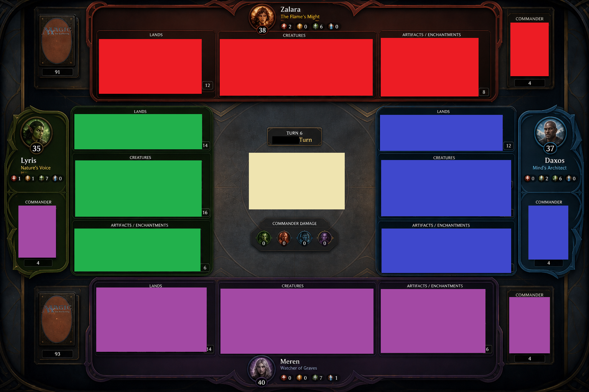

# Variant: `tabletop` — living map

**Status:** scaffold landed (B-0). Per-element implementation slices pending.
**Variant name:** `tabletop` (registered in `webclient/src/layoutVariants.tsx`).
**Reference:** [`commander_board_v2.png`](variant-tabletop/commander_board_v2.png).
**Origin:** comprehensive layout overhaul started 2026-05-03 from the user-supplied `commander_board_v2` reference. Follows the picture-catalog pattern from the slice 70-I → 70-Z redesign.

---

## Load-bearing decisions (read before any tabletop slice lands)

These constraints come from the user's slice-B-0 sign-off and override the matching defaults in the `current` variant:

- **Cards render full Scryfall art via the existing `<CardFace>` component** (slice B-0 user direction 2026-05-03). The featureless rectangles in the reference screenshot are lo-res rendering, not an intentional simplification. No new "tabletop-style placeholder" component is needed; tabletop reuses `<CardFace>` exactly as `current` does. Card art is decoration only — zone placement, type-bucketing, and chrome are the variant's load-bearing differences from `current`.
- **Action panel floats above the layout — never displaces it** (slice B-0 user direction 2026-05-03). The current REDESIGN's bottom-right morphing `<ActionButton>` (slice 70-M) keeps its position in tabletop, BUT it must render as a floating overlay (`position: fixed` with a high z-index + drop shadow) so the tabletop grid + zones underneath are NOT pushed up or reflowed to make room. The button is decorative chrome over the board, not a layout participant. This is intentional: the user's reference image shows zones that go all the way to the bottom edge, and the action button sits atop them.
- **Zones are fixed dimensional anchors; cards inside adapt.** The colored zone containers (and the type-bucket boxes inside each zone) hold a fixed footprint that does NOT shrink/expand based on how full they are. Cards within a zone CAN shrink and/or stack to fit the available space — same spirit as the existing `LAYOUT_BOUNDS` Tier 2 behavior, but scoped per-zone-bucket rather than per-pod. **Vertical scroll within a zone is the last-resort worst-case** — it only kicks in if the cards-shrink-and-stack strategy can't fit the content. The intent: layout shape stays stable across game state changes; only the per-card density adapts.
- **Target viewport: 1440p (2560×1440)** (slice B-0.5 user direction 2026-05-03). Layouts are tuned and tested at this resolution. Stability across viewport resizes is NOT a goal for this variant — the design is built and reviewed on 1440p hardware. Sub-1440p degradation is acceptable; super-1440p stretching is acceptable.
- **Zone stability is irrefutable within a viewport.** Three layers enforce the guarantee that pod positions never shift under game-state changes (more permanents, modals opening, action panel rendering, etc.):
  1. **CSS Grid with sized tracks** — every grid track is explicitly sized (`fr` or `%`); never `auto`. Cell bounding rects depend only on viewport size.
  2. **Component architecture** — anything that isn't a pod stays out of the grid: action panel `position: fixed`, modals via portals, hover details `absolute`-positioned outside the flow.
  3. **Tests** — `webclient/src/game/tabletopLayoutInvariants.test.tsx` asserts the structural CSS classes that deliver the guarantee (jsdom-level, slice B-0.5). Real-pixel measurements via Playwright are a future slice (B-0.6 candidate).
- **Variant scope is fixture-mode-first.** Tabletop is iterated against `?game=fixture&variant=tabletop`. The production game window keeps rendering `current` until the user signs off on a tabletop graduation cutover.
- **No engine code touched.** All work happens in `webclient/`. Java side and the wire format are untouched. No `schemaVersion` bump.
- **Switcher visible from B-0 onward.** `[ current | tabletop ]` button row appears in the fixture from slice B-0. Tabletop will look incomplete until all element slices ship — that's expected. Side-by-side comparison is the point.

---

## Element index

Sequenced by dependency (matches the implementation order — earlier elements unblock later ones). Status: `todo` / `in-progress` / `done` / `deferred`.

| # | Element | Region in screenshot | Target component(s) | Status | Slice ref |
|---|---|---|---|---|---|
| 1 | **Tokens & color palette** | All zone backgrounds (red / blue / green / purple) | `webclient/src/styles/tokens.css` (new `--tabletop-zone-colorless` token) + `webclient/src/game/halo.ts` (`computeTabletopZoneBackground` helper) | done | B-1 |
| 2 | **Wooden frame chrome** | Outer ornate border around the whole board | `Battlefield.tsx` 4-pod grid (`data-tabletop-frame` attribute + `border-2 border-zinc-800/80 rounded-lg` placeholder) | done (placeholder) | B-2 |
| 3 | **Per-pod colored zones** | Each pod's full background tinted to its commander color | `asymmetricT.tsx` `OpponentLane` + `LocalPod` (inline `style.background` gated on `useLayoutVariant() === 'tabletop'`) | done | B-1 |
| 4 | **Type-bucketed battlefield slots** | Lands / Creatures / Artifacts-Enchantments boxes within each pod | New `battlefieldLayout` strategy + new `BattlefieldRow` variant | todo | — |
| 5 | **Dedicated commander slot** | Top-corner (or zone-corner) box for the commander, separate from creatures | New slot inside the pod variant component | todo | — |
| 6 | **Graveyard / exile prominence** | Visible boxes in opponent pods (not just user) | Existing `ZoneIcon` repositioned per-pod; possibly larger | todo | — |
| 7 | **Central focal zone shrink** | "Stack & Turn" tile is smaller and less ornate than current | `StackZone` variant (`StackZone.tabletop.tsx`) | todo | — |
| 8 | **Phase indicators (TOP strip)** | Full-width top header strip via existing `GameHeader` (which already hosts PhaseTimeline in slice 70-O REDESIGN) | DemoGame mounts GameHeader as sibling above GameTable, mirroring real Game.tsx; production already mounts it the same way | done | B-7 |
| 9 | **Player portrait + life total positioning** | Portrait sits centered above pod for opponents, below pod for user; life total adjacent | `PlayerPortrait` + `PlayerFrame` variant | todo | — |
| 10 | **Hand fan (user)** | User's hand row at the bottom (visible cards) | `MyHand` — likely unchanged from current | todo | — |
| 11 | **Zone-overflow strategy (vertical scroll)** | Each zone gets `overflow-y: auto` when its content exceeds height | Per-zone scroll wrapper inside the pod variant component | todo | — |
| 12 | **Action panel placement** | Not visible in screenshot — TBD | TBD | deferred | — |

---

## Per-element specs

Each element below gets filled in during the walkthrough. Fields per element:

- **Source:** which region of the screenshot
- **Current behavior:** how the `current` variant handles this region (file:line)
- **Tabletop spec:** what the new behavior should be
- **Visual diff vs current:** specific changes (color / size / position / chrome)
- **Structural diff vs current:** component-arrangement changes
- **Implementation tier:** mechanical / standard / architectural
- **Critic tier:** which specialists to run for this slice
- **Acceptance:** what "done" looks like, including a screenshot capture for visual diff

### 1. Tokens & color palette

- **Source:** Every per-pod color (red, blue, green, purple); the tan/cream of the central tile; the dark wood frame.
- **Current behavior:** `webclient/src/styles/tokens.css:115-124` defines `--color-mana-{white,blue,black,red,green}` (full-saturation hex) plus matching `-glow` variants at ~50% alpha (`rgba(...)` tuned for halo overlay use). `webclient/src/game/halo.ts:41-59` `computeHaloBackground(colorIdentity, eliminated)` returns the full-sat token for single-color, a conic-gradient of full-sat tokens with `from var(--halo-angle, 0deg)` rotation for multicolor, and `--color-team-neutral` for empty/eliminated.

- **Tabletop spec** (slice B-0 user direction 2026-05-03):
  1. **Token reuse, not new mana-color tokens.** Tabletop zone backgrounds reuse the existing `--color-mana-*-glow` tokens (alpha-reduced rgba already in `tokens.css`). Composited on the dark zinc battlefield bg, they produce exactly the "lower-saturation than the screenshot's full intensity" tone the user asked for in answer #2 — no new mana-color tokens needed.
  2. **One new token: colorless commanders.** Add `--tabletop-zone-colorless` — warm off-white pulled toward gold (suggested starting value: `rgba(245, 230, 180, 0.5)`; tune in slice). This deliberately diverges from `--color-team-neutral` (a desaturated blue-grey) which was the colorless fallback in `current`; user wants tabletop's colorless players to read as "ivory + gold," not "neutral grey."
  3. **Multicolor: rotating, banded, NOT blended.** Reuse `computeHaloBackground`'s conic-gradient mechanism unchanged — N colors = N distinct arcs at `360°/N` each, hard transitions, rotating via `--halo-angle`. 3-color commander = 3 visible color bands, exactly as the user specified in answer #3.
  4. **Eliminated: stay on `--color-team-neutral` for now.** User direction #5 — "neutral for now, greyscale [of original color] likely in future." Future enhancement (probably its own slice once tabletop visuals are stable): swap to a `filter: grayscale(1)` treatment on the zone so eliminated retains the original commander color identity but desaturated.
  5. **New helper, not modified existing.** Add `computeTabletopZoneBackground(colorIdentity, eliminated)` alongside `computeHaloBackground`. Same shape/signature, different token map (uses `*-glow` tokens for colors, the new `--tabletop-zone-colorless` for empty, `--color-team-neutral` for eliminated). Keeps `computeHaloBackground` untouched so portrait halos in `current` don't change.

- **Visual diff vs current:** introduces large-area saturated-but-soft color washes per pod where `current` has dark zinc with subtle halo-only color accents. Card art remains crisp because the alpha-reduced glow tokens composite onto dark zinc, not onto a pure colored backdrop.
- **Structural diff vs current:** one new CSS variable (`--tabletop-zone-colorless`); one new exported helper in `halo.ts` (or a new tabletop-specific module). No existing tokens / helpers modified.
- **Implementation tier:** mechanical (1 token + 1 helper function — ~30 LOC including tests).
- **Critic tier:** UI critic (validate the alpha-reduced glow tokens at full-zone scale produce readable card surface; tune alpha if cards look muddy on red/black zones).
- **Acceptance:** new helper has unit tests for each branch (1-color / 2-color / 3-color / 4-color / 5-color / colorless / eliminated). Tokens documented in `tokens.css` with a comment block linking back to this doc. No visual surface yet — element #3 (per-pod colored zones) consumes the helper.

### 2. Wooden frame chrome

- **Source:** Outer ornate border around the entire board.
- **Current behavior:** `GameTable.tsx` renders the grid directly with no outer frame chrome.
- **Tabletop spec:** **placeholder only** (slice B-0 user direction 2026-05-03 — *"wooden frame is not something I'm committed to"*). Implement as a thin wrapper `
` with a neutral dark border and a `data-tabletop-frame` attribute so we can light up the real treatment later without re-plumbing. The wooden look is deferred until the user confirms a direction (real image asset / CSS gradient / SVG / none).
- **Open questions:** revisit treatment after the colored zones land — the frame may end up unnecessary if the zones already define the board edge clearly.
- **Implementation tier:** mechanical (wrapper div + stub border).
- **Critic tier:** none (placeholder).

### 3. Per-pod colored zones

- **Source:** Red zone behind Zafara (top), blue behind Zaven (right), green behind Lyrra (left), purple behind Mirren (user, bottom).
- **Current behavior:** `PlayerArea.tsx` wraps each pod with subtle dark accent chrome; the colored halo is on `PlayerPortrait` only via `computeHaloBackground(colors, ...)` from `halo.ts`.
- **Tabletop spec:** Zone background color is **driven by each player's commander color identity** (slice B-0 user direction 2026-05-03). Use the new `computeTabletopZoneBackground()` helper from element #1 — same shape as `computeHaloBackground` but maps to `--color-mana-*-glow` tokens (alpha-reduced) for colored, `--tabletop-zone-colorless` (ivory+gold) for colorless, `--color-team-neutral` for eliminated. Multicolor zones rotate via `--halo-angle` with N distinct bands (no blending). The screenshot's solid-per-pod look corresponds to the single-color case; the alpha-reduced tokens composite onto dark zinc to produce the "lower-saturation than full intensity" tone the user wants.
- **Open questions:** does the existing `PlayerPortrait` halo stay (layered on top, redundant signal), or get suppressed for tabletop (the zone background carries the color signal so the portrait halo is unnecessary)? — defer to walkthrough.
- **Implementation tier:** standard.
- **Critic tier:** UI + Graphical (alpha / saturation / contrast tuning so card art inside the zone stays readable; the screenshot shows fairly saturated zone colors, but full Scryfall card art layered on top may need a desaturated or alpha-reduced background).

### 4. Type-bucketed battlefield slots

- **Source:** Within each pod, three named horizontal-row boxes: **Lands**, **Creatures**, **Artifacts-Enchantments**. Creatures bucket is visibly the largest (≈40-50% of pod height in the reference); Lands and Artifacts-Enchantments are smaller (≈25% each).
- **Current behavior:** `webclient/src/game/battlefieldLayout.ts` partitions permanents by zone-row geometry, not type; `current` REDESIGN renders rows of all permanents per pod and uses `LAYOUT_BOUNDS` Tier 2 to shrink card size when content overflows.
- **Tabletop spec** (slice B-0 user direction 2026-05-03):

  **Bucket count: 3** (final list, no Planeswalkers / Battles / Tokens splits):
  - **Lands** — only `LAND` permanents.
  - **Creatures** — `CREATURE` + `PLANESWALKER` + creature tokens (per user answer #1; planeswalkers and walker-style standalone permanents live alongside creatures because they share the "things that attack/block" affordance space).
  - **Artifacts-Enchantments** — `ARTIFACT` + `ENCHANTMENT` + `BATTLE` (per user answer #1; battles lumped with artifacts despite their flippable mechanic).

  **Bucket size ratios:** match the reference image proportions per pod — Creatures ≈ 50% of pod-internal height, Lands ≈ 25%, Artifacts-Enchantments ≈ 25%. Tune exact percentages during slice; reference is the spec authority.

  **Per-bucket card sizing:**
  - **Lands bucket:** smaller card size than other buckets (per user answer #3). Lands stack/overlap horizontally — exact peek-offset TBD during slice (suggested ~30-40% peek so each land's name + tap status are scannable).
  - **Creatures bucket:** standard card size; tapped cards rotate 90° in place; multiple creatures of the same type can stack-overlap horizontally (per user answer #5) when the bucket fills.
  - **Artifacts-Enchantments bucket:** standard card size; same stacking + tapped-rotation behavior as creatures.

  **Card layout within a bucket:** single horizontal row per bucket, left-to-right; no row-wrapping (per user answer #4 — "exactly as in picture"). Overflow is handled by cards-shrink-and-stack inside the bucket (per the load-bearing decision §3); vertical scroll on the bucket as last-resort fallback only.

  **Card ordering within a bucket:** preserve server-emitted insertion order (the engine's `Map<UUID, PermanentView>` iteration via `LinkedHashMap`). Same wire-format invariant the stack-fix slice (commit `da8f32af`) locked in for the stack zone — server is the source of truth, client renders in the order it received them.

  **Tapped state:** rotated 90° in place per the current convention (per user answer #5). Stacking math accounts for the rotated bbox (a tapped card's *visible width* is its un-tapped *height*, ≈ 1.4× its un-tapped width).

  **Critical departure:** type-bucket boxes are **fixed-size containers** — they don't shrink/expand based on content density (per load-bearing decision §3 above). Cards inside them shrink/stack to fit. Vertical scroll per bucket only as last resort.

- **Implementation tier:** **Architectural** (new layout-strategy file, new bucket component, new card-stacking logic, new test surface). Likely splits into 3-4 sub-slices when implemented:
  - **B-#A:** `tabletopBattlefieldLayout.ts` — pure partition function `(permanents) → { lands, creatures, artifactsEnchantments }`; engine type-tag mapping; tests for hybrid-type cards.
  - **B-#B:** `TabletopPodBuckets.tsx` — three vertical-stacked bucket boxes per pod with the size ratios; empty-bucket placeholders; consumes the partition function.
  - **B-#C:** card-stacking layout inside a bucket — small-land sizing, horizontal peek-overlap when the bucket fills, tapped rotation accommodating overlap math.
  - **B-#D:** wire-up — `Battlefield.tsx` reads `useLayoutVariant()`, branches to the asymmetric-T (current) or new tabletop layout. Variant-test coverage parameterized over both.

- **Critic tier:** Technical + UI + UX. Technical: partition function correctness across hybrid types (artifact creatures, enchantment creatures), card-stacking math, layout containment. UI: visual diff against reference, bucket border treatment, empty-bucket state. UX: hover/click affordance when cards are stacked (hovered card brings to front?), keyboard nav order across buckets.

- **Acceptance per implementation slice:** unit tests for partition function (every card type → expected bucket); component tests asserting 3 buckets render per pod; visual diff against reference for the demo fixture; existing zone-stability invariant test (`tabletopLayoutInvariants.test.tsx`) passes against the new layout.

- **Resolved clarifications** (slice B-0 user direction 2026-05-03):
  1. **Hybrid types: "creature wins."** Artifact creatures (Walking Ballista), enchantment creatures (Bestow), animated lands (manlands while animated), enchantment-creature, etc. → all go to the **Creatures** bucket whenever the `CREATURE` type is currently active on the permanent. Lands that animate into creatures move from Lands → Creatures as their type tag flips (re-partition on type change, same rule as the Battle flip below).
  2. **Attachments (Auras + Equipment): stay anchored to host card** with a clickable badge on the card face indicating the attachment. Preserves the slice 70-N attachment chain visuals + `+N` count badges. The badge becomes a clickable affordance — exact click action (popover with attachment list / cycle through attachments / open focused view) is a small UX choice deferred to the implementation slice.
  3. **Card-stack peek offset: 10% visible per stacked card.** Tight stack — only the topmost card is fully readable; underneath cards show a 10%-wide strip (essentially title-only). Stacking math budget: a bucket that fits N cards at full size fits ~10N cards stacked at 10% peek before scroll kicks in.
  4. **Empty bucket state: visible label inside the empty colored region.** Player with zero lands → an empty Lands box still renders with a faint "Lands" label inside, so the bucket geometry is visible at a glance even when uninhabited. Same for empty Creatures / Artifacts-Enchantments buckets.
  5. **Battle flip: re-partition.** When a battle flips to its creature/planeswalker side, the permanent moves from Artifacts-Enchantments → Creatures bucket on the next render frame. Bucket reflects the permanent's *current* type tag, not its original cast type.
- **Implementation tier:** architectural (new layout strategy + new test surface).
- **Critic tier:** Technical + UI + UX (interaction patterns for click/hover when scrolled).

### 5. Dedicated commander slot

- **Source:** Small box per pod showing the commander, positioned at the *outside corner* of each pod relative to the layout center:
  - **TOP opponent:** right of pod (horizontal row's right end).
  - **BOTTOM (user):** right of pod (horizontal row's right end).
  - **LEFT opponent:** below pod (vertical column's bottom).
  - **RIGHT opponent:** below pod (vertical column's bottom).
- **Current behavior:** Commander is a permanent on the battlefield like any other; commander zone is a side-panel zone counter (`ZoneIcon` chip), not a dedicated slot.
- **Tabletop spec** (slice B-0 user direction 2026-05-03):

  **Slot position:** per the table above — outside corner of each pod.

  **Render rules by commander location** (the engine emits per-player commander cards in zone tracking — wire-format already carries this):
  - **In command zone (cast'able):** slot shows the commander's `<CardFace>` with the same hover behavior as any other card (existing `<HoverCardDetail>` popover for full info). The slot is **clickable to cast** — click triggers the existing `castCommander` priority-action affordance (same code path the side-panel `ZoneIcon` chip currently invokes).
  - **On the battlefield:** slot **renders empty** (per user answer #2). The commander itself sits in the Creatures bucket like any other creature. No duplicate render. The slot shows the same empty-bucket faint label treatment from element #4.5 (e.g., "Commander").
  - **In graveyard / exile / library** (after death, banishment, etc., before being recast): slot is empty (same as on-battlefield case — the slot only shows the card when it's *in the command zone* and ready to cast).

  **Commander tax** (user answer #5): the existing `<CardFace>` mana-cost overlay (top-right of card chrome) already renders the cost. For commander tax, **update the cost overlay value** to include `{2}` per prior cast (engine tracks this; need to verify the wire-format DTO carries the tax-adjusted cost or just the base cost). If wire only carries base cost, the client needs a small computation: `displayedCost = baseCost + ('{2}' * priorCasts)`. This is arguably a general-purpose enhancement that should land in `current` too — flag for a separate slice if so.

  **Interaction flow:**
  - Hover commander slot → existing `<HoverCardDetail>` popover (card info, rules text, current tax-adjusted cost).
  - Click commander slot when commander is in command zone → cast (priority must be active for that player).
  - Click commander slot when commander is on battlefield → no-op (slot is empty; nothing to click).

- **Visual diff vs current:** new dedicated slot rendering vs. zone-counter-chip-only treatment in `current`. Slot is fixed-size like the buckets in element #4 — small footprint at the pod's outside corner.
- **Structural diff vs current:** new component `TabletopCommanderSlot.tsx` (or similar) inside the tabletop pod variant. Side-panel `ZoneIcon` for `commandZone` may be removed or de-emphasized for tabletop variant since the dedicated slot is the new primary surface; defer that decision to slice time.
- **Implementation tier:** standard.
- **Critic tier:** UI critic (slot positioning + size proportion vs reference); UX critic (cast-from-slot click affordance, keyboard nav from slot to bucket and back, accessibility of the empty-state label).
- **Acceptance:** dedicated slot renders in the right corner per pod; `?game=fixture&variant=tabletop` shows commander cards in slots for fixtures where commander is in command zone; slot empties out (label only) when fixture moves commander to battlefield; click-to-cast triggers the same priority action `current` triggers from the side panel.

- **Open questions for the user** (defer until implementation slice):
  1. **Slot size.** Same as a single bucket-card width? Smaller? Larger? Reference is small relative to bucket cards.
  2. **Slot chrome.** Border / glow / nameplate inside the slot? Or just the bare `<CardFace>` against the zone-color background?
  3. **Wire-format check.** Does `WebPlayerView.commandZone` (or similar) currently carry the commander card on the wire so the client can render it without inferring? — recon question for the implementation slice.
  4. **Multi-commander formats** (Partner, Background, Brawl) — slot shows both commanders side-by-side, stacked, or one with a peek of the other? Not visible in single-commander reference.
  5. **Attachment-badge clickable behavior** (carried over from element #4.2): what does clicking the badge do — popover list, cycle through, focused view? Pinning here so it doesn't get lost.

### 6. Graveyard / exile / library — per-pod prominence

- **Source:** Each pod has its own zone-icon cluster directly beneath the player name + commander name. Reference shows them inline with the name area, anchored to the pod's outer chrome rather than to a global side panel.
- **Current behavior:** `ZoneIcon` chips for graveyard / exile / library live in the side-panel cluster (slice 70-P); opponent zones reachable via click-to-open zone-browser modal. The user's local pod has its chips co-located with the side panel; opponent chips reused the same component but were never positioned per-pod.
- **Tabletop spec** (slice B-0 user direction 2026-05-03):

  **Position:** the icon cluster lives **directly beneath the player name + commander name** on every pod (user AND opponents). No more side-panel cluster for these zones in the tabletop variant — they're per-pod chrome.

  **Arrangement matches the pod orientation:**
  - **TOP / BOTTOM pods** (horizontal layout): icons arranged **horizontally** in a row alongside the name block.
  - **LEFT / RIGHT pods** (vertical layout): icons arranged **vertically** stacked in a column under the name block.

  **Per-zone treatment:**
  - **Graveyard:** clickable icon button (existing `ZoneIcon` component); shows the per-player card count via the existing chip count mechanism. Click opens the existing **zone-browser modal** for that player's graveyard. Modal is the same one used today across `current` and earlier slices — reuse, don't reinvent.
  - **Exile:** clickable icon button — same component, separate icon, separate zone-browser modal. **Do NOT merge graveyard + exile into one button** (per user answer #4); they're independent zones with different game semantics, deserve independent surfaces.
  - **Library:** **non-clickable counter** displayed alongside the GY + Exile icons. Library isn't browsable mid-game in the general case (only specific effects let you look at your own library); a count is the right level of information surface. Clicking the counter does nothing in tabletop's default; effect-driven browse-library affordances continue to use whatever priority dispatch path they use today.
  - **Hand counter (opponents only):** non-clickable counter displayed alongside the GY/Exile/Library counters (per element #10 user direction 2026-05-03). Surfaces opponent hand size — the strategic signal "do they have a counterspell?" — that's currently absent in `current`. Reads `player.handCount` (already on the wire). No counter for the user's own pod (their hand is visible in the fan).

  **Click → modal:** every clickable icon (GY + Exile) opens the existing zone-browser modal scoped to the clicked player's zone. Works for the user's own zones AND opponents' zones — the browser modal already supports both today.

  **Counts:** the existing `ZoneIcon` already renders a count badge; tabletop reuses it as-is.

  **Empty zone state:** icon stays visible with count = 0; click on empty zone opens the modal showing "no cards" (matches current behavior in the existing modal).

- **Visual diff vs current:** zone-icon cluster moves from the side panel to per-pod under-the-name area on every pod. Library promotes from a clickable chip (in some flows) to a passive counter for tabletop. No new modal — the click target opens the same zone-browser the rest of the app uses.
- **Structural diff vs current:** new placement inside each pod's `PlayerFrame` (or its tabletop variant); the side-panel cluster's slot for these zones (in `current`) is no longer used by tabletop.
- **Implementation tier:** standard — reuse `ZoneIcon` + zone-browser modal; the change is positioning/layout. No new components needed unless the per-pod arrangement requires a new wrapper.
- **Critic tier:** UI critic (positioning + spacing per pod orientation; verify icons remain legible at the smaller pod-frame scale); UX critic (verify click affordance reaches the same modal regardless of pod / player; keyboard nav order from name → icons).
- **Acceptance:** in `?game=fixture&variant=tabletop`, every pod (user + 3 opponents) shows GY + Exile + Library cluster beneath its name area, oriented per pod. Clicking GY or Exile on any pod opens the existing zone-browser modal for that player's zone. Existing zone-browser tests pass unchanged (we're moving the click-trigger location, not the modal).
- **Open questions for the user** (defer until implementation slice):
  1. **Icon size at smaller pod scale.** The icons in the reference look small. Match `current`'s `ZoneIcon` size, or scale down for tabletop?
  2. **Library counter position.** Inline alongside GY + Exile icons (suggested), or separately positioned? "Counter next to graveyard/exile icons" per user is roughly inline — confirm.
  3. **Hover treatment for opponents' zones.** Currently `current` has a "small tooltip with last N cards" on opponent GY hover (slice 70-P). Carry that into tabletop, or click-to-open is enough?
  4. **Side-panel cleanup.** Once tabletop variant lands, does the side panel for tabletop drop the GY/Exile/Library cluster entirely, or does it keep them as a redundant secondary surface? Default suggestion: drop them; per-pod is the new primary.

### 7. Central focal zone — scaled focal stack + turn info

- **Source:** The central area of the board (the "Stack & Turn" tile in the reference) bounded by the four pods. Reference frames it small relative to the full board, but the tile sits inside a substantial inhabitable region (≈30% width × 50% height of viewport at 1440p) so the actual usable area is generous.
- **Current behavior:** `StackZone.tsx` renders a 128px (`--card-size-focal`) focal card with halo, fan tiles 1-4 at decreasing scale (slice 70-N+), spinning gold spotlight ring around the focal edge, "+N more" overflow pill (non-clickable). Combat-arrow mode swaps in when stack is empty AND combat is in progress.
- **Tabletop spec** (slice B-0 user direction 2026-05-03):

  **Sizing:** the focal stack **fills a good chunk of the central space** unoccupied by other zones (per user answer #1) — NOT tiny like the reference suggests at first glance. Use the available central-cell budget to size the focal card up from `current`'s 128px to fit comfortably (target: scale focal card to ~200-240px range with fan tiles to the right, leaving margin for halo bloom). Exact size derived per pod-cell measurements at slice time; final value tuned visually against the demo fixture.

  **Render mechanism:** option (a) per user answer #2 — **same focal-card mechanism as `current`**, just scaled to fill the central zone. Reuse `StackZone.tsx` + `FocalCard` + `StackFan` exactly as they exist today; the only change is the wrapping `--card-size-focal` token value (or a tabletop-specific size override). All slice-70-N visual semantics preserved: focal at full scale, fan tiles 1-4 at decreasing scale, "+N more" pill on overflow.

  **Halo + spotlight:** **kept 100%** (per user answer #3). Color-identity halo (`computeHaloBackground` → conic-gradient or solid), `--halo-angle` rotation animation for multicolor, spinning gold spotlight ring (`animate-stack-spotlight-rotate`), color-identity bloom — all preserved unchanged from `current`.

  **Fan tiles:** kept (per user answer #4). Picture-catalog §3.1 fan-tile mechanism (4 tiles right of focal at 0.80 / 0.68 / 0.58 / 0.49 scale, left-edge-on-previous-center anchoring) carries over verbatim. Plus a **new clickable backup affordance**: when stack overflow exists (5+ entries past the focal, where the "+N more" pill currently shows), the pill becomes **clickable** and opens a stack-browser modal showing the full stack contents. New component candidate: `StackBrowserModal.tsx` (or extend the existing zone-browser modal to accept stack as a virtual zone). This is arguably a general-purpose enhancement that should land in `current` too — flag for separate slice if so.

  **Combat-arrow mode:** **kept** (per user answer #5). When stack is empty AND combat is in progress, the central zone switches to drawing attack/block arrows from attacker BattlefieldTiles to defender PlayerPortraits (or blocker BattlefieldTiles when blocked). All slice-70-N geometry, listener mechanics, and `useCombatFingerprint` memoization carry over unchanged.

  **Turn / active-player text label:** **inside the central zone, below the focal stack** (per user answer #6). New small text label rendering:
  - "Turn N" (e.g., "Turn 7")
  - "ActivePlayerName" (e.g., "MAJEST1C") — emphasized typographically
  - No phase information (phases live in element #8's bottom-strip `PhaseTimeline`, separate surface, **no overlap**).

  Wire-format already carries `gameView.turn: number` and `gameView.activePlayerName: string` via `WebGameView` — no schema bump needed.

- **Visual diff vs current:** focal card grows in size to fill central area; "+N more" pill becomes clickable; new turn/active-player text label appears below focal. Halo + spotlight + fan + combat-arrow mode all unchanged.
- **Structural diff vs current:** focal-card sizing is now a per-variant token / wrapper-style choice; new `TurnInfoLabel.tsx` component (or inline JSX) for the turn/active-player text; new `StackBrowserModal.tsx` (or zone-browser extension) for the clickable overflow pill.
- **Implementation tier:** standard (reuses heavy lifting from slice 70-N; new pieces are small).
- **Critic tier:** UI critic (focal sizing tuning vs available central area; turn-info label position relative to focal + fan; stack-browser modal layout). Technical critic (verify focal card scales correctly without breaking the slice 70-N layoutId graph; verify clickable overflow pill doesn't break existing tests).
- **Acceptance:** in `?game=fixture&variant=tabletop`, the central area shows: focal card scaled appropriately for the cell; fan tiles right of focal; halo + spotlight + bloom intact; turn/active-player label below focal; combat-arrow mode triggers on appropriate state. Clicking "+N more" pill (when ≥5 stack entries) opens a browse modal showing full stack contents.

- **Open questions for the user** (defer until implementation slice):
  1. **Exact focal scale.** The 200-240px range is a starting estimate. Will tune visually during implementation; any bias toward "even bigger" or "more conservative"?
  2. **Turn-info typographic emphasis.** "Turn 7 — MAJEST1C" with the player name in their commander color? Bold? Different weights for "Turn N" vs the name?
  3. **Stack-browser modal shape.** New component vs extend the existing zone-browser modal to accept a synthetic stack zone? Latter is less code; former lets us tailor the modal for stack-specific affordances (resolve order indicators, target lines, etc.).
  4. **Promote enhancements to `current`?** Clickable "+N more" pill + turn-info text label are arguably general-purpose improvements. Land them in `current` too in a separate slice, or keep tabletop-only?

### 8. Phase indicators (full-width TOP strip)

- **Source:** Small phase-segment row at the top of the screen.
- **User direction (slice B-0, 2026-05-03 — corrected from earlier "bottom strip" spec):** keep the existing `PhaseTimeline` component verbatim, mount it as a **full-width TOP strip** (header position) — like the legacy / earlier-slice layouts had it. The earlier B-0 spec said "bottom strip" but the user corrected this in the element #10 walkthrough; the reverse is now in effect.
- **Current behavior:** `PhaseTimeline.tsx` renders the phase segments; placement varies by slice (header strip in legacy, side-panel in earlier REDESIGN, central focal cell in current REDESIGN).
- **Tabletop spec:** Same `PhaseTimeline` component, mounted in a **top header strip** in the tabletop `GameTable` variant. Full viewport width; height ~24-32px (tune during slice). Above all other tabletop layout elements.
- **Implementation tier:** mechanical (component is reused; only the grid placement changes).
- **Critic tier:** UI critic (verify the strip doesn't visually conflict with the top opponent's portrait + name area).
- **Open question for the user:** does the top opponent's portrait (which sits centered above their colored zone per element #9) sit ABOVE or BELOW this top strip? Two readings:
  - **(a)** Strip at very top edge → opponent portrait below it, then opponent's colored zone below portrait.
  - **(b)** Opponent portrait at very top edge → strip is below the portrait band, just above the four-pod arrangement.
  Default suggestion: (a) — phase timeline is global UI chrome, not pod-specific; portrait belongs to the player's pod chrome and sits inside that frame.

### 9. Player portrait + life total positioning per pod

- **Source:** Each pod's portrait centered on the outside edge of its zone (away from layout center), with life total badge overlapping the portrait and player name positioned per pod orientation.
- **Current behavior:** `PlayerPortrait.tsx` (slice 70-J) renders the portrait with color-identity halo (`computeHaloBackground`), `--halo-angle` rotation for multicolor, lane spotlight (rotating gold streak), bloom layer; life total badge overlaps the bottom of the portrait. `PlayerFrame.tsx` wraps portrait + name + commander name + life into a unified frame. Positioning is grid-area-driven in `GameTable.tsx` for the asymmetric-T layout.
- **Tabletop spec** (slice B-0 user direction 2026-05-03):

  **Portrait position per pod** (per user answer #1, confirmed; bottom-pod corrected during element #10 walkthrough):
  - **TOP opponent:** portrait centered **above** the colored zone.
  - **BOTTOM (user / local player):** portrait positioned at the **far bottom-left** of the pod's area (NOT centered below — corrected 2026-05-03 during element #10 walkthrough). The bottom-left corner placement frees up the bottom-center for the hand fan and mirrors common card-game UX patterns (Hearthstone / Arena style identity panel in a corner).
  - **LEFT opponent:** portrait centered **to the left** of the colored zone.
  - **RIGHT opponent:** portrait centered **to the right** of the colored zone.

  **Portrait treatment:** **reuse `PlayerPortrait.tsx` verbatim** with all current visual effects intact (per user answer #2):
  - Color-identity halo (multicolor → conic-gradient with `--halo-angle` rotation, single-color → solid mana-token glow, eliminated → neutral).
  - Lane spotlight (rotating gold streak around portrait edge for active player).
  - Bloom + glow layers (recent slice 70-Z polish work).
  - All `data-essential-motion="true"` attributes preserved.
  - All click + hover affordances pass through.

  **Life total badge:** **overlapping the bottom of the portrait** (per user answer #3) — same as current's existing badge mechanism. **Plain number** rendering (per user answer #4) — no shield / heart / styled chrome; just the numeric value in clean type. Reuse the existing badge styling from `PlayerPortrait` / `PlayerFrame`; no new chrome.

  **Player name placement** (per user answer #5):
  - **LEFT / RIGHT opponents:** player name positioned **below** the portrait (commander name below the player name as a sub-line).
  - **TOP / BOTTOM pods:** player name positioned **to the right of** the portrait (commander name to the right of the player name OR below it as a sub-line — confirm during implementation).

  **Hover affordance** (per user answer #6): **streamlined to commander-card-display only** — when in a commander game, hovering the portrait shows the player's commander card + info via existing `<HoverCardDetail>` popover (already used elsewhere in the app). Other hover affordances that may exist in `current` (commander damage breakdown, monarch / designation tooltips, etc.) are dropped or de-emphasized in tabletop. In non-commander games where there's no commander card to show, hover does nothing on the portrait.

  **Existing surface to preserve regardless of pod position:**
  - GY / Exile / Library cluster (element #6) — sits **directly beneath the player + commander name** on the inner side of the pod (between portrait+name and the colored zone). Arrangement (horizontal vs vertical) follows the pod orientation rules from element #6.
  - Commander slot (element #5) — sits at the outside corner of the pod (right of top/bottom; below left/right). Independent of portrait positioning.

- **Visual diff vs current:** primary change is portrait+name+life-badge **placement per pod orientation**; the portrait/badge/halo visuals themselves are unchanged. Hover surface narrows to commander-card-only.
- **Structural diff vs current:** new orientation-aware positioning logic — `PlayerArea` (or its tabletop variant) places `PlayerPortrait` based on a `position: 'top' | 'bottom' | 'left' | 'right'` prop. The component itself stays import-only (no internal rewrites). Hover handler simplified to gate non-commander-card affordances behind a feature flag or behind `if (variant === 'tabletop')`.
- **Implementation tier:** standard (reuses heavy lifting; new pieces are positioning + slim hover gating).
- **Critic tier:** UI critic (positioning per orientation; verify halo + spotlight + bloom geometry hold at the new positions; verify name placement reads cleanly relative to the colored zone). UX critic (verify hover affordance removal doesn't drop a critical info path that players need — e.g., is there ANY surface in tabletop that shows commander damage to opponents?).
- **Acceptance:** in `?game=fixture&variant=tabletop`, all 4 portraits render at their pod's outer edge with halos/spotlights/bloom intact; life badges overlap portraits with plain numbers; player names positioned correctly per orientation; hovering a portrait shows the player's commander card via `HoverCardDetail` (commander game) or does nothing (non-commander game).
- **Open questions for the user** (defer until implementation slice):
  1. **Commander damage visibility.** Tabletop drops the commander-damage hover tooltip from the portrait. Players still need to know if they've taken lethal commander damage from a specific opponent (21 damage = loss). Where does that info surface — on the commander slot itself, on the portrait via a small badge instead of hover, or via a different affordance?
  2. **Top/bottom name layout.** "Right of portrait" — is the commander name on the next line below the player name, or further right? Defer to implementation visual tuning.
  3. **Eliminated-player treatment.** Current's slash-overlay + neutral halo for eliminated players — does that stay in tabletop, or is there a tabletop-specific eliminated treatment?

### 10. Hand fan (user)

- **Source:** Bottom-most row across the screen, above the bottom pod's colored zone.
- **Current behavior:** `MyHand.tsx` renders a fan of cards with rotation per position, hover-to-zoom, click-to-cast, drag-to-reorder, fixed-bottom anchoring.
- **Tabletop spec** (slice B-0 user direction 2026-05-03):

  **Verbatim reuse.** Tabletop imports the **EXACT same `MyHand`** component from `current` with **all existing effects intact**:
  - Fan curve geometry (slice-70-F arc + per-card rotation).
  - Hover-to-zoom (`HoverCardDetail` integration).
  - Click-to-cast affordance (priority dispatch).
  - **Drag-to-reorder cards in hand** (slice-XX user-feature, preserved).
  - Cinematic cast animation (slice 70-Z).
  - Fixed-bottom anchoring with `--card-size-large` derived offset.
  - Empty-hand state (per user answer #6): the fan area **stays empty / invisible** when handCount is 0 — no placeholder, no message; the fan is practically invisible without cards anyway.

  **No tabletop-specific re-implementation.** If `MyHand` improves in `current`, tabletop inherits the improvement automatically. If something tabletop-specific is needed (e.g., a different anchor offset to clear the bottom pod's bucket area), prefer a positioning prop on `MyHand` over a fork.

  **Position:** bottom of screen (per user answer #1), full viewport width along the bottom edge.

  **Visibility model** (per user answer #2):
  - **User's own hand:** fully visible in the fan as `current` renders it (card art + rules text on hover).
  - **Opponents' hands:** **NOT** rendered as card backs anywhere on the board — instead, opponent hand size shows as a **counter alongside the GY / Exile / Library cluster** in element #6. (Updates element #6 — opponent hand counter joins that cluster.)

- **Visual diff vs current:** none for the user's hand fan — pixel-identical reuse. For opponents, hand-count surface moves from being implied (no surface in `current`) to a small counter inside the per-pod GY/Exile/Library cluster.
- **Structural diff vs current:** `MyHand` import only — zero internal changes. Per-pod cluster from element #6 grows by one count surface.
- **Implementation tier:** trivial (verbatim component reuse + small counter addition to the cluster from element #6).
- **Critic tier:** UI critic (verify hand fan and bottom pod chrome don't visually conflict at 1440p; verify opponent-hand counter integrates legibly with the GY/Exile/Library cluster).
- **Acceptance:** in `?game=fixture&variant=tabletop`, the user's hand fan looks and behaves byte-identically to `current`'s hand fan — re-order, hover-to-zoom, click-to-cast, animations, all preserved. Opponent pods show a hand-count number in the cluster beneath their name.

### 11. Zone-overflow strategy (cards adapt, zones don't)

- **Source:** Implied — when a player has more permanents than fit, the zone footprint stays the same and the cards inside adapt.
- **Current behavior:** `LAYOUT_BOUNDS` Tier 2 shrinks `--card-size-medium` per pod (whole pod scales).
- **Tabletop spec:** Three-stage adaptation strategy, scoped per type-bucket inside a fixed-size zone:
  1. **Shrink cards** — reduce card size within the bucket (analogous to current's `--card-size-medium` scaling but per-bucket).
  2. **Stack cards** — overlap cards inside the bucket if shrink alone doesn't fit (e.g., fan-style stacking with the top card fully visible).
  3. **Vertical scroll** — last-resort `overflow-y: auto` on the bucket if shrink + stack still don't fit.
- **Critical:** **zones themselves never shrink/expand.** Layout shape is stable across game state.
- **Implementation tier:** standard (per-bucket CSS scaling logic + scroll fallback).
- **Critic tier:** UI critic + UX (interaction patterns when scrolled — click/hover targets must still work).

### 12. Action panel placement

- **Source:** Not visible in reference (mockup omission). User direction (slice B-0, 2026-05-03): keep current's bottom-right morphing `<ActionButton>` placement.
- **Current behavior:** `<ActionButton>` (slice 70-M) renders as a flex-positioned element inside the side-panel grid cell at the bottom-right of the layout. Destructive actions (Concede, Leave) live inside `<SettingsModal>` (slice 70-O) reachable from the header.
- **Tabletop spec:** Same `<ActionButton>` component, same bottom-right corner, BUT rendered as a **floating overlay** — `position: fixed` (or absolute over a positioned ancestor) with a high `z-index` and a drop shadow. The tabletop grid + zones underneath must NOT reflow to accommodate it; zones go edge-to-edge as in the reference image, the button floats over them. Destructive-action `<SettingsModal>` reachability stays the same as current — gear icon in the header, modal opens centered.
- **Critical:** the floating-overlay rule is a load-bearing constraint (also captured in §load-bearing decisions). If the button ends up displacing zones or pushing the layout, the slice is wrong.
- **Implementation tier:** standard.
- **Critic tier:** UI critic (z-order ladder — make sure the button doesn't accidentally land below the zones; verify the drop shadow + click-target stay legible at the busiest possible board state). UX critic (verify the button is reachable + clickable when zones underneath are visually busy).
- **Open questions:** drop-shadow color/blur (probably a soft black at low alpha; tune during slice). Does the button gain a backdrop blur for glass-morphism? — defer to UI critic.

---

## Walkthrough cadence

We walk through one element at a time. For each:

1. I open the relevant source files and current-behavior `file:line` citations.
2. You describe the target — what the screenshot shows, how it should differ from current, what's important.
3. I ask clarifying questions if any.
4. I write the spec into the section above.
5. We move to the next element.

After all element specs are filled in, we begin the implementation slices in dependency order (1 → 2 → 3 → ...).

---

## Open questions for the user (pre-walkthrough)

A few things I'd like answered before we start element-by-element so I can prep accordingly:

1. **Wooden frame asset:** is this a literal image asset you'll provide, a CSS-gradient simulation, or schematic ornamentation we design from scratch? If a real image, what's the source / licensing?
2. **Zone color semantics:** are the per-pod colors driven by the player's commander color identity (multicolor commanders → blended)? Or are they assigned in a fixed cycle (top=red, right=blue, etc., regardless of who's playing what)? The screenshot looks fixed-cycle but commander-driven would feel more thematic.
3. **Card art:** in the screenshot, the cards within zones look like featureless rectangles. Is this just lo-res rendering, or do tabletop variants intentionally hide card art for opponents (showing only colored placeholders)?
4. **Action panel:** where does it go? (Question 12 above.)
5. **Phase timeline:** keep current's phase indicators verbatim, or replace with something simpler in the icon row?

We'll cover these as part of the walkthrough; flagging here so you know they're coming.

---

## Critic-pass-log + commit references

| Slice | Commit | Element(s) | Critics |
|---|---|---|---|
| B-0 | _pending_ | Scaffold (asset + doc + registry) | builder only (mechanical tier) |
